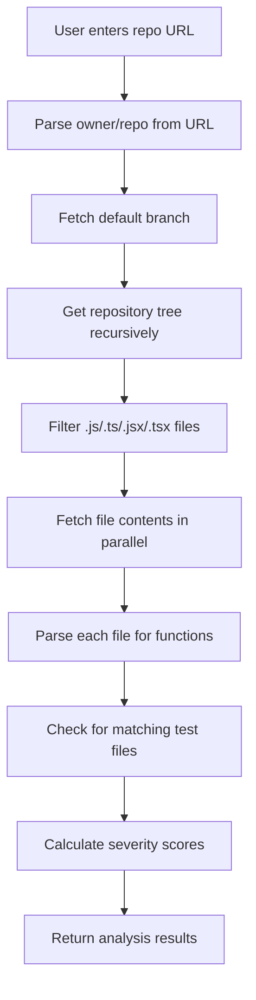
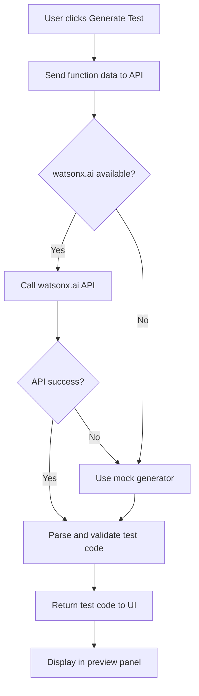

# TestForge Pro - 24-Hour MVP Architecture Plan
**IBM Bob Hackathon Project**

## Executive Summary

TestForge Pro is a Next.js application that scans GitHub repositories, detects untested JavaScript/TypeScript functions, generates Jest tests using IBM watsonx.ai, and creates pull request workflows. This architecture is designed for a 24-hour hackathon with demo-safe fallbacks and IBM Bob integration documentation.

---

## 1. MVP Feature Scope & Priorities

### Core Features (Must-Have)
1. **Repository Analysis** - Fetch GitHub repo files via API, parse JS/TS functions
2. **Test Coverage Detection** - Identify functions without corresponding test files
3. **AI Test Generation** - Generate Jest tests using IBM watsonx.ai Granite
4. **Test Preview UI** - Display generated tests with syntax highlighting
5. **Demo Mode** - Prepared mock data for demos without GitHub/API setup

### Secondary Features (Should-Have)
6. **Pull Request Creation** - Generate PR with test files via GitHub API
7. **Severity Scoring** - Classify untested functions by risk level
8. **IBM Bob Documentation** - Export session reports to `bob_sessions/`

### Deferred Features (Won't-Have for MVP)
- Actual repository cloning
- Multi-language support beyond JS/TS
- Test execution/validation
- User authentication
- Database persistence

---

## 2. API Route Architecture

### State Management Strategy
**Move from Client to API Routes:**
- GitHub API calls (authentication, file fetching, PR creation)
- watsonx.ai API calls (test generation)
- Function parsing and analysis logic
- Error handling and retry logic

**Keep in Client:**
- UI state (selected function, loading states)
- Form inputs (repo URL)
- Display logic and animations

### API Routes Structure

```
app/api/
├── analyze/
│   └── route.ts          # POST: Analyze repository
├── generate-test/
│   └── route.ts          # POST: Generate test for function
├── create-pr/
│   └── route.ts          # POST: Create GitHub PR
└── health/
    └── route.ts          # GET: Check API/credentials status
```

#### `/api/analyze` - Repository Analysis
**Request:**
```typescript
POST /api/analyze
{
  "repoUrl": "https://github.com/owner/repo",
  "branch": "main" // optional
}
```

**Response:**
```typescript
{
  "success": true,
  "data": {
    "functions": [
      {
        "name": "calculateTotal",
        "file": "src/utils.ts",
        "lineNumber": 15,
        "tested": false,
        "severity": "High",
        "reason": "No matching test file found",
        "code": "function calculateTotal(items) { ... }"
      }
    ],
    "stats": {
      "totalFunctions": 25,
      "testedFunctions": 18,
      "untestedFunctions": 7
    }
  }
}
```

#### `/api/generate-test` - AI Test Generation
**Request:**
```typescript
POST /api/generate-test
{
  "functionName": "calculateTotal",
  "functionCode": "function calculateTotal(items) { ... }",
  "filePath": "src/utils.ts",
  "context": "// surrounding code for context"
}
```

**Response:**
```typescript
{
  "success": true,
  "data": {
    "testCode": "import { calculateTotal } from '../src/utils';\n\ndescribe('calculateTotal', () => { ... });",
    "testFilePath": "src/__tests__/utils.test.ts",
    "provider": "watsonx" | "mock"
  }
}
```

#### `/api/create-pr` - Pull Request Creation
**Request:**
```typescript
POST /api/create-pr
{
  "repoUrl": "https://github.com/owner/repo",
  "branch": "add-tests-calculateTotal",
  "testFiles": [
    {
      "path": "src/__tests__/utils.test.ts",
      "content": "test code here"
    }
  ],
  "title": "Add tests for calculateTotal",
  "description": "Generated by TestForge Pro"
}
```

**Response:**
```typescript
{
  "success": true,
  "data": {
    "prUrl": "https://github.com/owner/repo/pull/123",
    "prNumber": 123
  }
}
```

---

## 3. File Structure & Organization

```
testforge-pro/
├── app/
│   ├── api/
│   │   ├── analyze/
│   │   │   └── route.ts              # Repository analysis endpoint
│   │   ├── generate-test/
│   │   │   └── route.ts              # Test generation endpoint
│   │   ├── create-pr/
│   │   │   └── route.ts              # PR creation endpoint
│   │   └── health/
│   │       └── route.ts              # Health check endpoint
│   ├── components/
│   │   ├── AnalyzeForm.tsx           # Repository input form
│   │   ├── FunctionList.tsx          # List of detected functions
│   │   ├── TestPreview.tsx           # Generated test display
│   │   ├── StatsCards.tsx            # Coverage statistics
│   │   └── BobProofBanner.tsx        # IBM Bob usage indicator
│   ├── lib/
│   │   ├── github/
│   │   │   ├── client.ts             # GitHub API wrapper
│   │   │   ├── parser.ts             # Parse JS/TS files for functions
│   │   │   └── pr-creator.ts         # PR creation logic
│   │   ├── ai/
│   │   │   ├── watsonx.ts            # IBM watsonx.ai client
│   │   │   ├── prompt-builder.ts     # Test generation prompts
│   │   │   └── mock-generator.ts     # Fallback mock tests
│   │   ├── analysis/
│   │   │   ├── function-detector.ts  # Detect functions in code
│   │   │   ├── test-matcher.ts       # Match functions to tests
│   │   │   └── severity-scorer.ts    # Calculate risk severity
│   │   └── utils/
│   │       ├── demo-data.ts          # Mock data for demo mode
│   │       └── validators.ts         # Input validation
│   ├── types/
│   │   ├── function.ts               # Function type definitions
│   │   ├── api.ts                    # API request/response types
│   │   └── github.ts                 # GitHub API types
│   ├── page.tsx                      # Main dashboard (refactored)
│   ├── layout.tsx
│   └── globals.css
├── bob_sessions/
│   ├── README.md                     # Documentation for judges
│   ├── 001-initial-setup.md          # Session export example
│   ├── 002-api-implementation.md
│   └── 003-ui-refinement.md
├── public/
├── .env.example
├── .env.local                        # Local environment variables
├── package.json
├── tsconfig.json
├── ARCHITECTURE.md                   # This file
└── README.md                         # Updated project README
```

### Key Files to Create Next (Priority Order)

1. **`app/types/function.ts`** - Core type definitions
2. **`app/lib/utils/demo-data.ts`** - Demo mode mock data
3. **`app/lib/github/client.ts`** - GitHub API integration
4. **`app/lib/github/parser.ts`** - Function detection logic
5. **`app/lib/ai/watsonx.ts`** - watsonx.ai integration
6. **`app/lib/ai/mock-generator.ts`** - Fallback test generator
7. **`app/api/analyze/route.ts`** - Analysis endpoint
8. **`app/api/generate-test/route.ts`** - Test generation endpoint
9. **`app/components/AnalyzeForm.tsx`** - Extract form component
10. **`app/components/FunctionList.tsx`** - Extract function list
11. **`bob_sessions/README.md`** - Bob documentation setup

---

## 4. Tech Stack Decisions

### Core Technologies
- **Framework:** Next.js 16.2.6 (App Router)
- **Language:** TypeScript 5.x
- **Styling:** Tailwind CSS 4.x
- **Runtime:** Node.js (Vercel deployment)

### External APIs & Services

#### GitHub API Integration
**Library:** `@octokit/rest` (official GitHub SDK)
```bash
npm install @octokit/rest
```

**Why:** 
- Official GitHub SDK with TypeScript support
- Handles authentication, rate limiting, pagination
- Well-documented for file fetching and PR creation

**Key Operations:**
- `repos.getContent()` - Fetch file contents
- `repos.createOrUpdateFileContents()` - Create test files
- `pulls.create()` - Create pull requests
- `git.createRef()` - Create branches

#### IBM watsonx.ai Integration
**Library:** `@ibm-cloud/watsonx-ai` or direct REST API
```bash
npm install @ibm-cloud/watsonx-ai
```

**Model:** IBM Granite Code (granite-13b-instruct-v2 or granite-20b-code-instruct)

**Why:**
- IBM-aligned for hackathon judging
- Code-specialized models for test generation
- Supports function-to-test prompting

**Fallback Strategy:**
- If watsonx.ai fails or credentials missing → use `mock-generator.ts`
- Mock generator creates realistic Jest tests based on function signatures
- Ensures demo never breaks

#### Code Parsing
**Library:** `@babel/parser` + `@babel/traverse`
```bash
npm install @babel/parser @babel/traverse @babel/types
npm install -D @types/babel__traverse
```

**Why:**
- Industry-standard JavaScript/TypeScript parser
- Accurate AST traversal for function detection
- Handles modern syntax (async/await, decorators, etc.)

**Alternative (Simpler):** `acorn` + `acorn-walk` (lighter weight)

#### Syntax Highlighting (Optional)
**Library:** `react-syntax-highlighter`
```bash
npm install react-syntax-highlighter
npm install -D @types/react-syntax-highlighter
```

**Why:**
- Easy integration for test preview
- Multiple themes available
- Supports Jest/TypeScript syntax

---

## 5. GitHub API Integration Strategy

### Authentication
```typescript
// app/lib/github/client.ts
import { Octokit } from '@octokit/rest';

export function createGitHubClient(token?: string) {
  return new Octokit({
    auth: token || process.env.GITHUB_TOKEN,
    userAgent: 'TestForge-Pro/1.0'
  });
}
```

### Repository Analysis Flow



### Key Implementation Details

**1. Repository Tree Fetching**
```typescript
// Get all files in repo
const { data: tree } = await octokit.git.getTree({
  owner,
  repo,
  tree_sha: defaultBranch,
  recursive: 'true'
});

// Filter for JS/TS files
const codeFiles = tree.tree.filter(file => 
  file.type === 'blob' && 
  /\.(js|ts|jsx|tsx)$/.test(file.path) &&
  !file.path.includes('node_modules') &&
  !file.path.includes('.test.') &&
  !file.path.includes('.spec.')
);
```

**2. Parallel File Fetching (Rate Limit Aware)**
```typescript
// Batch requests to avoid rate limits
const BATCH_SIZE = 10;
for (let i = 0; i < codeFiles.length; i += BATCH_SIZE) {
  const batch = codeFiles.slice(i, i + BATCH_SIZE);
  const contents = await Promise.all(
    batch.map(file => fetchFileContent(octokit, owner, repo, file.path))
  );
  // Process batch...
}
```

**3. Demo Mode (No GitHub Token Required)**
```typescript
// app/lib/utils/demo-data.ts
export const DEMO_REPO_DATA = {
  owner: 'demo-user',
  repo: 'ecommerce-app',
  files: [
    {
      path: 'src/paymentService.ts',
      content: `export function calculateFinalPrice(base: number, tax: number, discount: number) {
  if (base < 0) throw new Error('Base price cannot be negative');
  return base * (1 + tax) - discount;
}`
    }
    // ... more demo files
  ]
};
```

---

## 6. AI Test Generation Workflow

### watsonx.ai Integration

**Model Selection:** IBM Granite Code 13B Instruct V2
- Optimized for code generation
- Understands Jest testing patterns
- Good balance of speed and quality

**Prompt Engineering Strategy:**

```typescript
// app/lib/ai/prompt-builder.ts
export function buildTestGenerationPrompt(
  functionName: string,
  functionCode: string,
  filePath: string,
  context?: string
): string {
  return `You are an expert JavaScript/TypeScript test engineer. Generate comprehensive Jest tests for the following function.

Function to test:
\`\`\`typescript
${functionCode}
\`\`\`

File path: ${filePath}
${context ? `\nContext:\n${context}` : ''}

Requirements:
1. Use Jest testing framework
2. Include happy path test cases
3. Include edge cases (null, undefined, empty values)
4. Include error cases if function can throw
5. Use descriptive test names
6. Add simple mocks only if absolutely necessary
7. Follow Jest best practices

Generate ONLY the test file content, starting with imports. Do not include explanations.`;
}
```

**API Call Implementation:**

```typescript
// app/lib/ai/watsonx.ts
import { WatsonXAI } from '@ibm-cloud/watsonx-ai';

export async function generateTestWithWatsonX(
  functionName: string,
  functionCode: string,
  filePath: string
): Promise<string> {
  try {
    const watsonx = new WatsonXAI({
      apiKey: process.env.WATSONX_API_KEY,
      projectId: process.env.WATSONX_PROJECT_ID,
      region: process.env.WATSONX_REGION || 'us-south'
    });

    const prompt = buildTestGenerationPrompt(functionName, functionCode, filePath);

    const response = await watsonx.generateText({
      modelId: process.env.WATSONX_MODEL_ID || 'ibm/granite-13b-instruct-v2',
      input: prompt,
      parameters: {
        max_new_tokens: 1000,
        temperature: 0.3,  // Lower for more deterministic output
        top_p: 0.9,
        repetition_penalty: 1.1
      }
    });

    return response.results[0].generated_text;
  } catch (error) {
    console.error('watsonx.ai generation failed:', error);
    throw error;
  }
}
```

### Fallback Mock Generator

```typescript
// app/lib/ai/mock-generator.ts
export function generateMockTest(
  functionName: string,
  functionCode: string,
  filePath: string
): string {
  // Parse function signature
  const params = extractParameters(functionCode);
  const returnType = inferReturnType(functionCode);
  
  // Generate realistic test structure
  return `import { ${functionName} } from '${convertToImportPath(filePath)}';

describe('${functionName}', () => {
  it('should handle valid input correctly', () => {
    const result = ${functionName}(${generateSampleArgs(params)});
    expect(result).toBeDefined();
  });

  it('should handle edge cases', () => {
    expect(() => ${functionName}(${generateEdgeCaseArgs(params)})).not.toThrow();
  });

  ${generateErrorCases(functionCode, functionName, params)}
});`;
}
```

### Test Generation Flow



---

## 7. IBM Bob Integration & Documentation

### Bob Session Export Strategy

**Purpose:** Demonstrate IBM Bob usage throughout development for hackathon judges.

**Export Format:** Markdown files in `bob_sessions/` directory

**Session Structure:**
```markdown
# Bob Session: [Task Title]
**Date:** 2026-05-15
**Duration:** ~45 minutes
**Mode:** Code / Plan / Debug

## Task Prompt
[Original user request to Bob]

## Bob's Analysis
[Bob's initial assessment and planning]

## Implementation Approach
[Key decisions and reasoning]

## Code Generated
[Important code snippets or file changes]

## Challenges & Solutions
[Any issues encountered and how Bob helped resolve them]

## Outcome
[Final result and verification]
```

### Key Integration Points to Document

1. **Initial Architecture Planning** (This session)
   - File: `bob_sessions/001-architecture-planning.md`
   - Content: This architecture document creation process

2. **API Route Implementation**
   - File: `bob_sessions/002-api-routes-implementation.md`
   - Content: GitHub API integration, watsonx.ai setup

3. **Function Parser Development**
   - File: `bob_sessions/003-function-parser.md`
   - Content: Babel parser integration, AST traversal logic

4. **UI Component Refactoring**
   - File: `bob_sessions/004-ui-component-extraction.md`
   - Content: Breaking down page.tsx into reusable components

5. **Test Generation Logic**
   - File: `bob_sessions/005-test-generation.md`
   - Content: watsonx.ai prompt engineering, fallback logic

6. **PR Creation Workflow**
   - File: `bob_sessions/006-pr-workflow.md`
   - Content: GitHub PR API integration

7. **Bug Fixes & Refinements**
   - File: `bob_sessions/007-debugging-session.md`
   - Content: Any critical bugs fixed with Bob's help

### Automated Export Script (Optional)

```typescript
// scripts/export-bob-session.ts
import fs from 'fs';
import path from 'path';

interface BobSession {
  title: string;
  date: string;
  duration: string;
  mode: string;
  prompt: string;
  analysis: string;
  implementation: string;
  code: string;
  challenges: string;
  outcome: string;
}

export function exportBobSession(session: BobSession) {
  const sessionNumber = getNextSessionNumber();
  const filename = `${sessionNumber}-${slugify(session.title)}.md`;
  const filepath = path.join('bob_sessions', filename);
  
  const content = `# Bob Session: ${session.title}
**Date:** ${session.date}
**Duration:** ${session.duration}
**Mode:** ${session.mode}

## Task Prompt
${session.prompt}

## Bob's Analysis
${session.analysis}

## Implementation Approach
${session.implementation}

## Code Generated
\`\`\`typescript
${session.code}
\`\`\`

## Challenges & Solutions
${session.challenges}

## Outcome
${session.outcome}
`;

  fs.writeFileSync(filepath, content);
  console.log(`✅ Bob session exported: ${filename}`);
}
```

---

## 8. Phased Implementation Timeline (24 Hours)

### Phase 1: Foundation (Hours 0-6) - CRITICAL PATH

**Goal:** Working API routes with demo mode

**Tasks:**
1. ✅ Create type definitions (`app/types/`)
2. ✅ Set up demo data (`app/lib/utils/demo-data.ts`)
3. ✅ Implement GitHub client (`app/lib/github/client.ts`)
4. ✅ Create function parser (`app/lib/github/parser.ts`)
5. ✅ Build `/api/analyze` endpoint
6. ✅ Test with demo mode (no external APIs)

**Deliverable:** Working repository analysis with mock data

**Bob Documentation:** Export session for architecture planning and API setup

---

### Phase 2: AI Integration (Hours 6-12) - HIGH PRIORITY

**Goal:** Test generation working with fallback

**Tasks:**
1. ✅ Implement watsonx.ai client (`app/lib/ai/watsonx.ts`)
2. ✅ Create prompt builder (`app/lib/ai/prompt-builder.ts`)
3. ✅ Build mock generator fallback (`app/lib/ai/mock-generator.ts`)
4. ✅ Create `/api/generate-test` endpoint
5. ✅ Test with both watsonx.ai and fallback mode
6. ✅ Add error handling and retry logic

**Deliverable:** Reliable test generation with graceful fallback

**Bob Documentation:** Export session for AI integration and prompt engineering

---

### Phase 3: UI Refinement (Hours 12-18) - MEDIUM PRIORITY

**Goal:** Polished, demo-ready interface

**Tasks:**
1. ✅ Extract components from `page.tsx`
2. ✅ Add syntax highlighting to test preview
3. ✅ Improve loading states and animations
4. ✅ Add error messages and user feedback
5. ✅ Implement severity scoring display
6. ✅ Add demo mode toggle in UI

**Deliverable:** Professional, judge-ready UI

**Bob Documentation:** Export session for UI component refactoring

---

### Phase 4: PR Workflow (Hours 18-22) - NICE-TO-HAVE

**Goal:** Complete end-to-end workflow

**Tasks:**
1. ✅ Implement PR creator (`app/lib/github/pr-creator.ts`)
2. ✅ Create `/api/create-pr` endpoint
3. ✅ Add branch creation logic
4. ✅ Test PR creation flow
5. ⚠️ Add PR status tracking (if time permits)

**Deliverable:** Working PR creation (or graceful mock if GitHub API issues)

**Bob Documentation:** Export session for PR workflow implementation

---

### Phase 5: Polish & Documentation (Hours 22-24) - FINAL PUSH

**Goal:** Hackathon-ready submission

**Tasks:**
1. ✅ Update README.md with setup instructions
2. ✅ Finalize Bob session exports
3. ✅ Add demo video/screenshots
4. ✅ Test full workflow end-to-end
5. ✅ Deploy to Vercel
6. ✅ Prepare presentation talking points

**Deliverable:** Complete, deployed, documented project

**Bob Documentation:** Final session export summarizing project completion

---

## 9. Critical Simplifications for Hackathon Feasibility

### What to AVOID (Time Sinks)

❌ **Repository Cloning**
- Use GitHub API file fetching instead
- Saves deployment complexity and disk space

❌ **Database/Persistence**
- Keep everything stateless
- Use session storage for UI state only

❌ **User Authentication**
- Single-user app with environment variables
- No login/signup flow needed

❌ **Test Execution**
- Don't run generated tests
- Focus on generation quality, not validation

❌ **Multi-Language Support**
- JavaScript/TypeScript only
- Python/Java/etc. can be "future work"

❌ **Advanced Git Operations**
- No merge conflict resolution
- No commit history analysis
- Simple branch creation only

❌ **Real-Time Collaboration**
- No WebSockets or live updates
- Simple request/response model

### What to PRIORITIZE (Demo Impact)

✅ **Demo Mode**
- Works without any API keys
- Instant results for judges
- Prepared impressive examples

✅ **Visual Polish**
- Smooth animations
- Clear loading states
- Professional color scheme (already good!)

✅ **Error Handling**
- Graceful fallbacks everywhere
- Never show raw error messages
- Always provide next steps

✅ **IBM Branding**
- Prominent watsonx.ai mentions
- Bob session exports visible
- IBM color scheme integration

✅ **Code Quality Display**
- Syntax highlighting
- Severity badges
- Clear statistics

✅ **Fast Response Times**
- Parallel API calls
- Optimistic UI updates
- Cached demo data

---

## 10. Environment Variables Setup

```bash
# .env.local (create from .env.example)

# GitHub API (optional for demo mode)
GITHUB_TOKEN=ghp_your_token_here

# IBM watsonx.ai (primary AI provider)
WATSONX_API_KEY=your_watsonx_api_key
WATSONX_PROJECT_ID=your_project_id
WATSONX_REGION=us-south
WATSONX_MODEL_ID=ibm/granite-13b-instruct-v2

# Application Config
NEXT_PUBLIC_DEMO_MODE=true  # Enable demo mode by default
NEXT_PUBLIC_APP_URL=http://localhost:3000
```

### Credential Fallback Strategy

```typescript
// app/lib/utils/config.ts
export const config = {
  github: {
    token: process.env.GITHUB_TOKEN,
    enabled: !!process.env.GITHUB_TOKEN
  },
  watsonx: {
    apiKey: process.env.WATSONX_API_KEY,
    projectId: process.env.WATSONX_PROJECT_ID,
    region: process.env.WATSONX_REGION || 'us-south',
    modelId: process.env.WATSONX_MODEL_ID || 'ibm/granite-13b-instruct-v2',
    enabled: !!(process.env.WATSONX_API_KEY && process.env.WATSONX_PROJECT_ID)
  },
  demo: {
    enabled: process.env.NEXT_PUBLIC_DEMO_MODE === 'true'
  }
};

export function getAIProvider(): 'watsonx' | 'mock' {
  return config.watsonx.enabled ? 'watsonx' : 'mock';
}

export function getGitHubMode(): 'api' | 'demo' {
  return config.github.enabled ? 'api' : 'demo';
}
```

---

## 11. Deployment Strategy

### Vercel Deployment (Recommended)

**Why Vercel:**
- Native Next.js support
- Zero-config deployment
- Environment variable management
- Automatic HTTPS
- Fast global CDN

**Deployment Steps:**
```bash
# 1. Install Vercel CLI
npm install -g vercel

# 2. Login to Vercel
vercel login

# 3. Deploy
vercel --prod

# 4. Set environment variables in Vercel dashboard
# Settings → Environment Variables
```

**Environment Variables in Vercel:**
- Add all variables from `.env.local`
- Mark sensitive variables as "Encrypted"
- Set `NEXT_PUBLIC_DEMO_MODE=true` for public demo

### Alternative: Docker Deployment

```dockerfile
# Dockerfile (if needed)
FROM node:20-alpine
WORKDIR /app
COPY package*.json ./
RUN npm ci --only=production
COPY . .
RUN npm run build
EXPOSE 3000
CMD ["npm", "start"]
```

---

## 12. Testing Strategy (Minimal for Hackathon)

### Manual Testing Checklist

**Demo Mode:**
- [ ] App loads without any environment variables
- [ ] Mock data displays correctly
- [ ] Test generation works with fallback
- [ ] All UI interactions work smoothly

**GitHub Integration:**
- [ ] Can analyze public repository
- [ ] Handles invalid repo URLs gracefully
- [ ] Rate limit errors show helpful message

**AI Generation:**
- [ ] watsonx.ai generates valid Jest tests
- [ ] Fallback mock generator works
- [ ] Generated tests have correct imports

**PR Creation:**
- [ ] Can create branch and PR (or shows mock success)
- [ ] Error handling works for auth issues

### No Unit Tests Required
- Focus on working demo over test coverage
- Manual testing sufficient for 24-hour hackathon
- Can add tests post-hackathon if needed

---

## 13. Presentation Talking Points

### For Judges (2-Minute Demo Script)

**1. Problem Statement (15 seconds)**
"Developers spend hours writing tests. TestForge Pro automates this using IBM watsonx.ai to generate comprehensive Jest tests for untested functions."

**2. Live Demo (60 seconds)**
- Enter demo repository URL
- Show instant analysis of untested functions
- Generate test for high-severity function
- Preview AI-generated test with syntax highlighting
- Create pull request workflow

**3. Technical Highlights (30 seconds)**
- "Built with IBM watsonx.ai Granite Code model"
- "Parses JavaScript/TypeScript using Babel AST"
- "Integrates with GitHub API for seamless PR creation"
- "Graceful fallbacks ensure demo reliability"

**4. IBM Bob Integration (15 seconds)**
- "Developed entirely with IBM Bob as AI pair programmer"
- "All planning, implementation, and debugging sessions documented"
- "Session exports available in bob_sessions/ folder"

### Key Differentiators
- ✅ IBM-aligned (watsonx.ai, Bob integration)
- ✅ Production-ready UI (not a prototype)
- ✅ Real GitHub integration (not just mock data)
- ✅ Intelligent severity scoring
- ✅ Demo-safe with fallbacks

---

## 14. Risk Mitigation

### High-Risk Items & Mitigation

**Risk:** watsonx.ai API fails during demo
**Mitigation:** Mock generator fallback, demo mode with pre-generated tests

**Risk:** GitHub API rate limits
**Mitigation:** Demo mode with prepared data, caching strategy

**Risk:** Parsing fails on complex code
**Mitigation:** Error handling, skip unparseable files, show partial results

**Risk:** Generated tests are invalid
**Mitigation:** Basic validation, syntax checking, fallback to simpler templates

**Risk:** Deployment issues
**Mitigation:** Test deployment early (Hour 20), have local demo ready

**Risk:** Time overrun
**Mitigation:** Phased approach, each phase delivers working demo

---

## 15. Success Metrics

### Minimum Viable Demo (Must-Have)
- ✅ App loads and looks professional
- ✅ Demo mode works without setup
- ✅ Can analyze at least one repository
- ✅ Generates at least one valid test
- ✅ Bob session exports present

### Impressive Demo (Should-Have)
- ✅ Real GitHub integration works
- ✅ watsonx.ai generates quality tests
- ✅ PR creation workflow functional
- ✅ Severity scoring accurate
- ✅ Multiple test examples

### Exceptional Demo (Nice-to-Have)
- ✅ Deployed and publicly accessible
- ✅ Handles edge cases gracefully
- ✅ Fast response times (<3s per operation)
- ✅ Comprehensive Bob documentation
- ✅ Video demo prepared

---

## 16. Next Steps

### Immediate Actions (Start Now)

1. **Install Dependencies**
```bash
cd testforge-pro
npm install @octokit/rest @babel/parser @babel/traverse @babel/types
npm install -D @types/babel__traverse
```

2. **Create Type Definitions**
- Start with `app/types/function.ts`
- Define core data structures

3. **Set Up Demo Data**
- Create `app/lib/utils/demo-data.ts`
- Prepare realistic mock repository

4. **Begin API Implementation**
- Start with `/api/analyze` route
- Use demo data initially

5. **Document with Bob**
- Export this planning session
- Create `bob_sessions/001-architecture-planning.md`

### Development Order (Follow Phases 1-5)

Stick to the phased timeline above. Each phase builds on the previous and delivers a working demo. Don't skip ahead to "cool features" - focus on the critical path first.

---

## Conclusion

This architecture prioritizes **demo reliability** over feature completeness. Every component has a fallback, every API has mock data, and every phase delivers a working product. The 24-hour timeline is aggressive but achievable by focusing on the critical path and leveraging IBM Bob for rapid development.

**Key Success Factors:**
1. Demo mode ensures judges see working product
2. Phased approach allows early testing
3. IBM alignment (watsonx.ai + Bob) scores points
4. Graceful fallbacks prevent demo disasters
5. Clear documentation proves Bob usage

**Remember:** A polished demo of 3 features beats a broken demo of 10 features. Ship early, test often, document everything.

---

**Generated by IBM Bob - Planning Mode**
**Date:** 2026-05-15
**Project:** TestForge Pro MVP Architecture